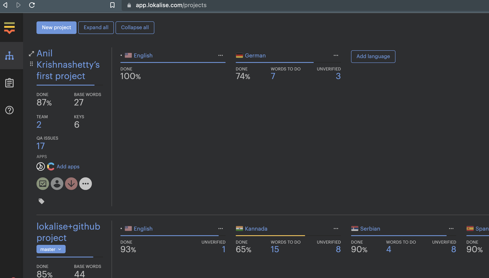
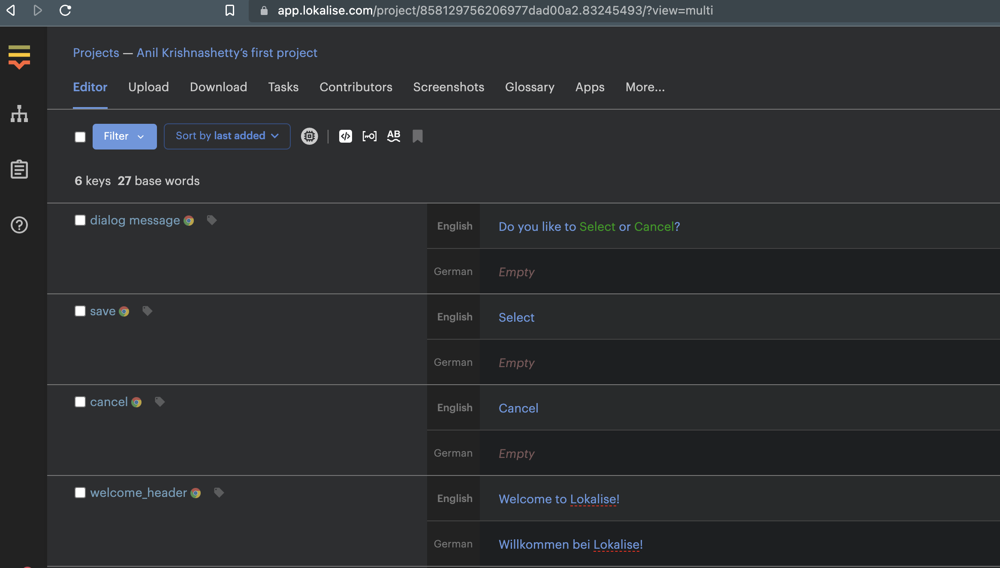
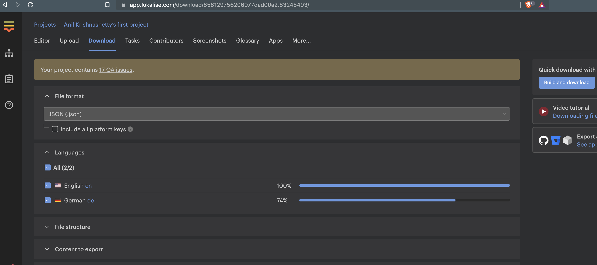
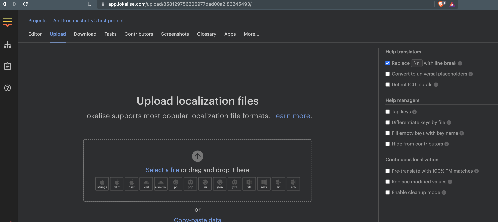

# lokalise-api-explorer-demo

1. [List projects](https://developers.lokalise.com/reference/list-all-projects)

2. [List project keys](https://developers.lokalise.com/reference/list-all-keys)

3. [Download file](https://developers.lokalise.com/reference/download-files)

4. [Upload a file](https://developers.lokalise.com/reference/upload-a-file)

